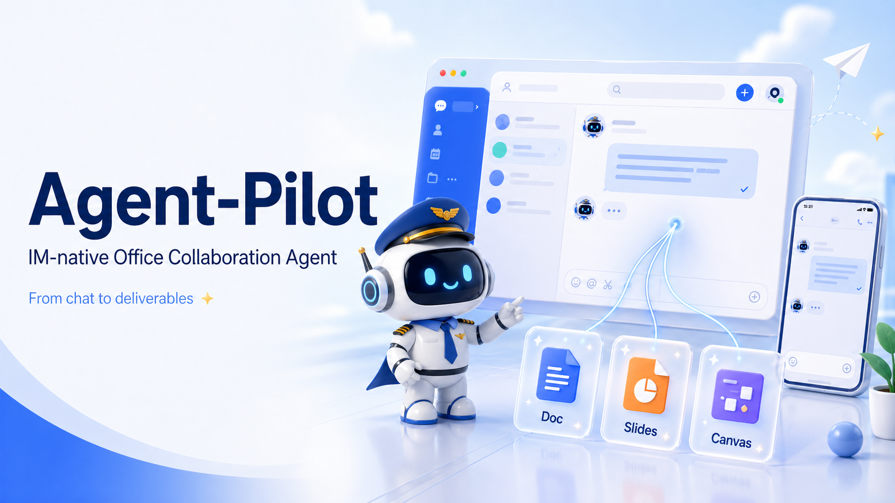

<div align="center">
  
  <h1>Agent-Pilot</h1>
  <h3>基于 IM 的办公协同智能助手</h3>
  <p><em>从飞书/Lark IM 对话到文档、汇报材料与画板的一键智能闭环</em></p>
  <p>
    
    
    
    
    
  </p>
</div>

## 项目简介

Agent-Pilot 是面向飞书/Lark 的办公协同智能助手，聚焦 **基于 IM 的办公协同智能助手** 比赛赛题。它把飞书作为主要交互界面：用户在 IM 中提出目标，Agent 理解任务、规划步骤、生成办公产物，并把结果回传到同一个会话。

核心目标不是再做一个外部工作台，而是一个真正 Feishu-native 的 Agent 工作流：

```text
Feishu IM
-> Agent 意图捕获
-> 任务理解与计划
-> 文档 / 幻灯片 / 画板生成
-> 同一 IM 会话交付
-> 进度查询与修改迭代
```

## 核心能力

- **IM 原生入口**：支持群聊或私聊中的自然语言任务发起。
- **Agent 任务规划**：Planner Agent 将目标拆解为可执行步骤和工具调用计划。
- **办公套件联动**：生成飞书 Doc、Slides、Canvas/Whiteboard 等交付物。
- **多端协同体验**：桌面端和移动端共享同一飞书会话、状态和产物链接。
- **进度与修改闭环**：支持 `当前进度`、`确认`、`修改：...`、`/reset` 等交互。
- **演示稳定性**：官方 MCP、`lark-cli`、fake artifact 多层 fallback，避免权限问题中断现场演示。

## 比赛场景映射

| 场景 | 赛题要求 | Agent-Pilot 对应实现 |
| --- | --- | --- |
| A | 意图 / 指令入口 | 飞书 IM 消息触发 Agent-Pilot 任务 |
| B | 任务理解和规划 | Planner Agent 生成执行计划与 ToolPlan |
| C | 文档 / 白板生成 | DocAgent 与 CanvasAgent 生成方案文档和架构画板 |
| D | 汇报材料生成 | PresentationAgent 生成 5 页答辩 Slides |
| E | 多端协同 | `chat_id` 绑定任务状态、产物链接和修改上下文 |
| F | 总结与交付 | DeliveryService 将最终成果回传到同一 IM 会话 |

## 快速开始

```bash
uv run pytest
uv run uvicorn app.main:app --reload
```

启动飞书 IM 事件监听：

```bash
uv run python scripts/lark_event_listener.py
```

推荐演示口令：

```text
@Agent 帮我基于飞书比赛赛题，生成一份参赛方案文档和 5 页答辩汇报材料。重点突出 Agent 编排、多端协同、飞书办公套件联动和工程实现。
```

## 技术栈

- Python / FastAPI
- Feishu/Lark `lark-cli`
- Official Feishu MCP Tool Layer
- OpenAI-compatible LLM endpoint
- pytest

## 文档

- [演示与运行指南](./docs/agent_pilot_demo.md)
- [架构与 Tool Layer 说明](./docs/agent_pilot_architecture.md)
- [重构设计文档](./docs/superpowers/specs/2026-04-26-agent-pilot-refactor-design.md)
- [Feishu MCP Tool Layer 设计](./docs/superpowers/specs/2026-04-27-feishu-mcp-tool-layer-design.md)

## 项目原则

**Feishu is the UI.** Agent-Pilot 不构建额外的桌面端、移动端或后台工作台；所有关键体验都应尽量发生在飞书 IM、Doc、Slides 和 Canvas/Whiteboard 中。
