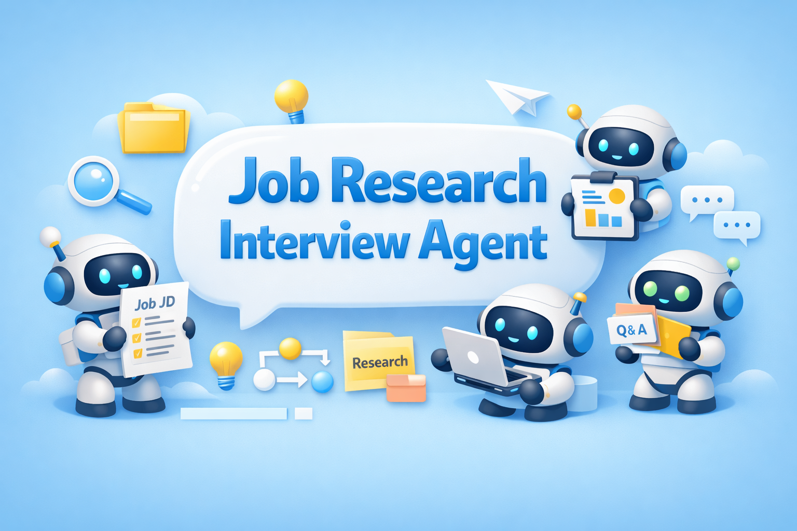

<div align="center">
  
  <h1>Job Research Interview Agent</h1>
  <h3>🔍 面向求职研究与面试准备的智能协同 Agent</h3>
  <p><em>把岗位 JD、公司调研、面试重点和结果沉淀串成一条连续工作流</em></p>
  
  
  
  
  
</div>

## 🎯 项目在做什么

这个项目聚焦一个很真实的场景: 当我们准备投递、研究岗位、了解公司、梳理面试重点时，信息通常散落在 IM、搜索引擎、个人笔记和临时文档里，过程重复、切换频繁，也很难协作。

`Job Research Interview Agent` 想做的，就是把这条链路收拢成一个可执行、可追踪、可沉淀的研究流程。用户提交岗位 JD、公司名称、面试主题和补充材料后，系统会自动拆解任务、生成研究步骤、执行公开信息检索，并整理出结构化的研究结果与报告雏形。

## 🚧 当前进度说明

目前这个仓库还处在原型阶段，已经打通了“任务输入 -> 研究规划 -> 信息检索 -> 报告草稿生成”的基础链路，可以用来展示项目方向和核心工作流，但还没有完全实现理想中的最终效果。

换句话说，它现在更像一个可运行、可继续扩展的第一版 Demo: 研究流程已经能跑起来，API 和任务产物也已经具备雏形，但距离真正成熟的“IM 发起任务、文档协同沉淀、结果持续迭代、展示内容自动生成”还有一段工程化与产品化完善的距离。

## ✨ 当前原型能力

目前仓库已经具备一条可以跑通的基础链路，而不只是概念说明:

- 支持结构化任务输入，围绕岗位要求、公司背景和面试主题自动生成基础研究计划
- 基于 Tavily 执行公开信息检索，并完成搜索结果归一化、去重、摘要整理与报告草稿生成
- 提供基础 API、SSE 流式接口和任务产物落盘能力，方便后续接入 IM Bot 或协同前端

## 🚀 为什么这个方向值得做

相比一个“只回答问题”的助手，这个项目更像一个围绕求职场景设计的研究协作者。它强调的不是一次问答，而是从输入理解、任务规划、信息检索到结果输出的完整闭环。

这也让它很适合继续往 IM 协同场景延展: 未来无论是接入飞书 Bot、同步飞书文档，还是把研究结果继续组织成汇报材料、面试提纲或展示页，都有比较自然的演进路径。

## 🧩 一次任务会经历什么

整个流程目前可以概括成 4 个动作:

1. 接收岗位 JD、公司信息和面试主题。
2. 自动拆出研究子任务，形成基础 planning。
3. 调用搜索服务收集外部资料，并生成阶段性 summary。
4. 汇总为最终报告，同时把中间产物写入任务目录，便于追踪和复用。

## 🛠️ 快速开始

仓库默认优先使用 `uv`。

### 1. 启动服务

```bash
uv run uvicorn app.main:app --reload
```

### 2. 运行测试

```bash
uv run pytest
```

### 3. 发起一个研究任务

```json
{
  "jd_text": "负责大模型应用研发，要求熟悉 Python、FastAPI、RAG、Agent 工作流设计",
  "company_name": "示例公司",
  "interview_topic": "AI 应用后端开发",
  "local_context_path": "data/example_resume.pdf",
  "user_note": "希望重点准备项目深挖与行为面问题"
}
```

当前原型提供的核心接口包括:

- `GET /health`
- `POST /tasks`
- `GET /stream`

## 📦 项目结构

```text
app/
├── agents/      # 任务规划、总结、报告相关 Agent
├── api/         # FastAPI 路由
├── core/        # 配置与 LLM 客户端
├── schemas/     # 输入输出与状态结构
├── services/    # 编排、搜索、RAG、记忆等服务
├── tools/       # 搜索与检索工具层
└── main.py      # 应用入口

tests/           # 当前原型测试
docs/            # 开发记录与说明
assets/          # README 资源
workspace/       # 仓库内已有任务产物目录
```

## 🌱 接下来可以继续补强的方向

这个仓库当前更偏“可运行原型”，下一步比较自然的增强方向包括:

- 接入飞书或其他 IM Bot，把任务入口真正放进协同链路
- 补齐本地资料解析与 RAG 能力，让候选人简历和项目材料参与研究
- 优化报告生成质量，把结果继续延展为面试提纲、汇报内容或展示页面
- 增强状态管理、测试覆盖和错误恢复能力，支撑更完整的真实使用
